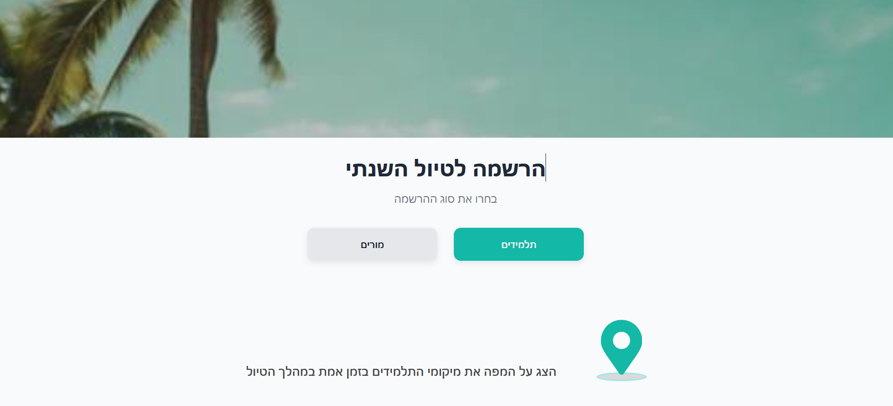
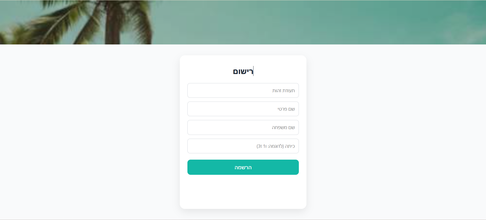
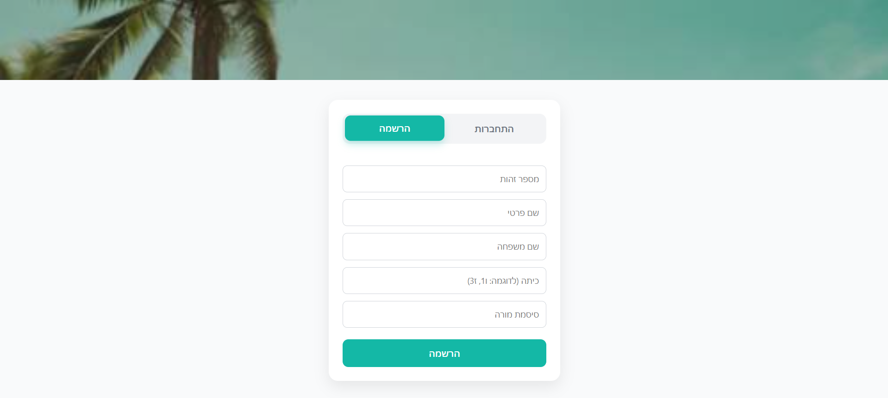
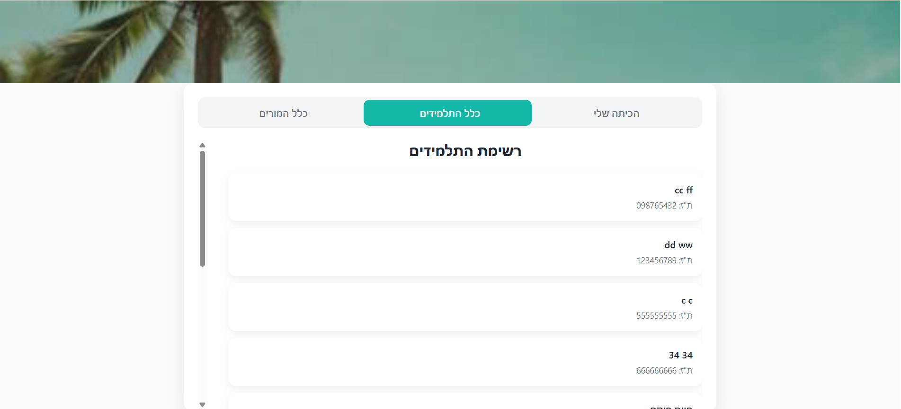
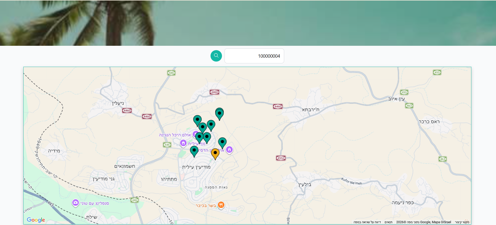
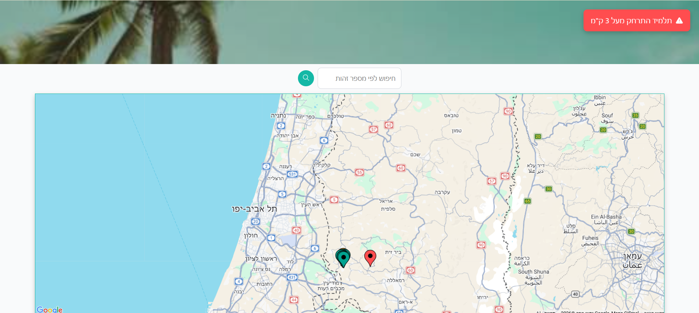

# School Trip Manager

## About The Project
A web-based system for managing school trips, enabling teachers and students to register and allowing teachers to monitor student locations in real-time.

### Features
- Student registration system
- Real-time location tracking
- Live map integration using Google Maps
- Alerts when students move beyond a defined distance
- WebSocket-based real-time communication

---

## Built With
- React (Vite)
- TypeScript
- Node.js (Express)
- WebSocket (ws)
- Google Maps API
- TypeORM
- PostgreSQL
- react-router-dom

---

## Getting Started

### Prerequisites
- Node.js
- npm
- PostgreSQL
- Google Maps API Key

---

## Installation

### Server
cd server  
npm install  
npm run dev  

### Client
cd client  
npm install  
npm run dev  

---

## Environment Variables

### Client (.env)
VITE_SERVER_BASE_URL=http://localhost:3000  
VITE_GOOGLE_MAPS_API_KEY=your_google_maps_api_key  

### Server (.env)
PORT=3000  
DB_HOST=localhost  
DB_USER=postgres  
DB_PASS=  
DB_NAME=school_trip_manager  
JWT_SECRET=your_jwt_secret_key  
TEACHER_PASSWORD=teacher_password  

---

## Run Migrations
npm run migration:run  

---

## Usage
1. Teacher creates or manages a trip  
2. Students register  
3. Teacher views student list  
4. Students send real-time location  
5. Locations displayed on map  
6. Alerts triggered if a student moves too far  

---

## Roadmap
- Advanced permissions system  
- Route history tracking  
- Improved alert system  
- Teacher analytics dashboard  

---

## Contact
Ruchama Brizel  
Email: R0527187861@gmail.com  

Project Link: https://github.com/ruchamy/trip-manager  

---

## License
MIT License
